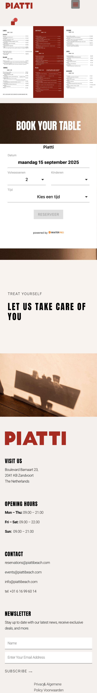
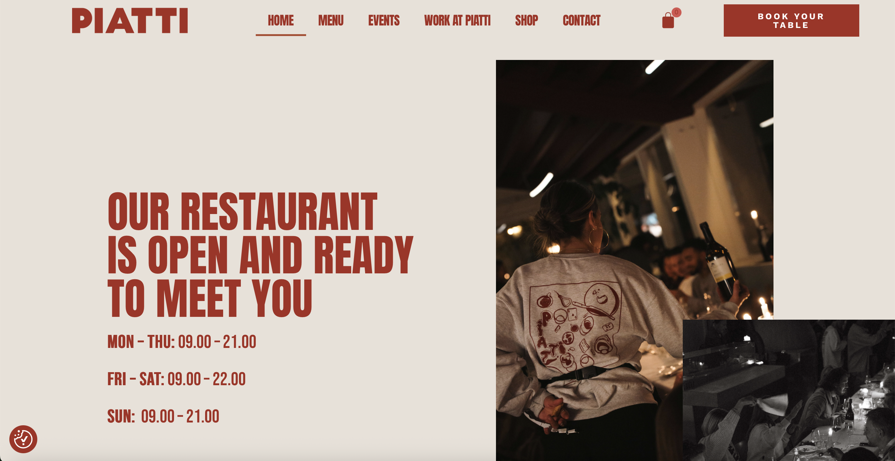
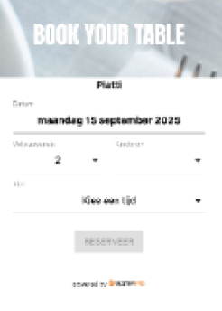

# Procesverslag
Markdown is een simpele manier om HTML te schrijven.  
Markdown cheat cheet: [Hulp bij het schrijven van Markdown](https://github.com/adam-p/markdown-here/wiki/Markdown-Cheatsheet).

Nb. De standaardstructuur en de spartaanse opmaak van de README.md zijn helemaal prima. Het gaat om de inhoud van je procesverslag. Besteedt de tijd voor pracht en praal aan je website.

Nb. Door *open* toe te voegen aan een *details* element kun je deze standaard open zetten. Fijn om dat steeds voor de relevante stuk(ken) te doen.

## Jij

  
uitwerken voor kick-off werkgroep

  ### Auteur:
  Joep Smit
  #### Je startniveau:
  Blauw

  #### Je focus:
  Responsive
 

## Je website

  
uitwerken voor kick-off werkgroep

  ### Je opdracht:
  https://piattibeach.com

  #### Screenshot(s) van de eerste pagina (small screen): 
  Home pagina - Piatti Beach
  

  #### Screenshot(s) van de tweede pagina (small screen):
  hier de naam van de pagina  
  
 

## Toegankelijkheidstest 1/2 (week 1)

  
uitwerken na test in 2e werkgroep

  ### Bevindingen
  Lijst met je bevindingen die in de test naar voren kwamen:
  Content: De taal is duidelijk op de pagina, er zit alleen qua vormgeving niet echt een logica in.
  Er worden veel verschillende font gebruikts. 
  Buttons zijn niet allemaal hetzelfde.
  Een goede HTML structuur is niet aanwezig.
  Een unique titel per pagina en zoompoort is aanwezig.
  De screenreader werkt niet goed genoeg. De titels worden voorgelezen, maar er is geen alt text bij de foto's
  Button en links werken goed. Er zit geen horizontal scrolling op de website.
  Er zit in de small screen variant niet altijd genoeg wit ruimte tussen de elementen.
  De headings zijn overzichtelijk, alleen is het voormij niet altijd duidelijk of er nu een h2, h3, h4 of een p wordt gebruikt.
  Er wordt geen gebruik gemaakt vind list items.
  De links zijn bijna allemaal duidelijk te vinden, soms zit er een verstopt in een foto.
  Er is geen dark of high contrast mode.
  De gebruikte animatie zijn subtiel, ze sliden mooi in het scherm.
  De color contrast is aanwezig.

## Breakdownschets (week 1)

  
uitwerken na afloop 3e werkgroep

  ### de hele pagina: 
  

  ### dynamisch deel (bijv menu): 
  

  ### wellicht nog een dynamisch deel (bijv filter): 
  

## Voortgang 1 (week 2)

  
uitwerken voor 1e voortgang

  ### Stand van zaken
  hier dit ging goed & dit was lastig (neem ook screenshots op van delen van je website en code)

  ### Agenda voor meeting
  samen met je groepje opstellen

  | Joep 1          | Casper 2          | Yael 3          | student 4        |
  | ---             | ---               | ---             | ---              |
  | Fontface/family | Zoekbalk          | Hamburgermenu   | ---              |
  | ---             | ---               | ---             | ---              |
  | ...             | ...               | ...             | ...              |

  ### Verslag van meeting
  hier na afloop snel de uitkomsten van de meeting vastleggen

Per pagina 1 style sheat dus 2 css
Een gezamelijke pagina.
boven in moet de gezamelijke style sheet.
Hamburgermenu is een button. 
De nav in de header is een unorderd list.
<a href="#"> learn more about Yael</a> . visually hidden
h1 toevoegen met visually hiden. a11y
form voor newsletter

  - punt 1
  - punt 2
  - nog een punt
  - ...

## Voortgang 2 (week 3)

  
uitwerken voor 2e voortgang

  ### Stand van zaken
  hier dit ging goed & dit was lastig (neem ook screenshots op van delen van je website en code)

  ### Agenda voor meeting
  samen met je groepje opstellen

  | Casper         | Joep               | Yael         | student 4        |
  | ---            | ---                | ---          | ---              |
  | HamburgerMenu  | HamburgerMenu      | Nav bar      | en dan ik dat    |
  | ...            | Transitie nav bar  | ...          | dit wil ik zeker |
  | ...            | ...                | ...          | ...              |

  ### Verslag van meeting
  hier na afloop snel de uitkomsten van de meeting vastleggen

  - punt 1
  - punt 2
  - nog een punt
- ...

## Toegankelijkheidstest 2/2 (week 4)

  
uitwerken na test in 9e werkgroep

  ### Bevindingen
  Lijst met je bevindingen die in de test naar voren kwamen (geef ook aan wat er verbeterd is):

## Voortgang 3 (week 4)

  
uitwerken voor 3e voortgang

  ### Stand van zaken
  hier dit ging goed & dit was lastig (neem ook screenshots op van delen van je website en code)

  ### Agenda voor meeting
  samen met je groepje opstellen

  | Yael           | Casper             | Joep               | student 4        |
  | ---            | ---                | ---                | ---              |
  | Hamburger Menu | Hamburger Menu     | Hamburger Menu     | en dan ik dat    |
  | ...            | ...                | Input              | dit wil ik zeker |
  | ...            | ...                | Foto Overlay       | ...              |

  ### Verslag van meeting
  hier na afloop snel de uitkomsten van de meeting vastleggen

  - punt 1
  - punt 2
  - nog een punt
  - ...

## Eindgesprek (week 5)

  
uitwerken voor eindgesprek

  ### Je uitkomst - karakteristiek screenshots:
  

  ### Dit ging goed/Heb ik geleerd: 
  Korte omschrijving met plaatjes

  

  ### Dit was lastig/Is niet gelukt:
  Korte omschrijving met plaatjes

  

## Bronnenlijst

  
continu bijhouden terwijl je werkt

  Nb. Wees specifiek ('css-tricks' als bron is bijv. niet specifiek genoeg). 
  Nb. ChatGpT en andere AI horen er ook bij.
  Nb. Vermeld de bronnen ook in je code.

  1. bron 1
  2. bron 2
  3. ...

